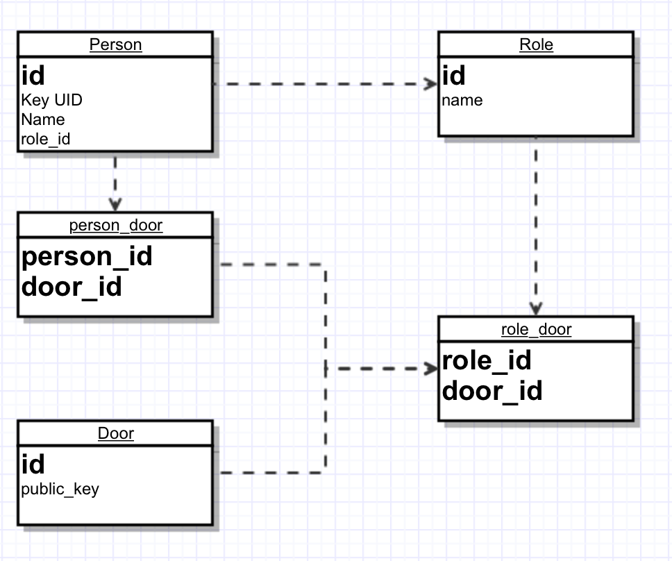

Brainstorm session 25/10/2016

#Requirements

##Arduino
- A 'door' ID
- The server's Public Key
- A custom Public Private key pair

##Server
- The public keys of all arduino's (Stored in the DB)
- A custom Public Private key pair
- A database with the Hashed UID's of the cards and the doors to which they have access

##Key
- A custom UID

#Implementation
*Arduino side*  
1. The arduino reads a key and gets its UID  
2. The arduino makes a value key pair with its own door ID and the read UID  
3. The arduino encrypts this value key pair using the servers public key  
4. The arduino sends this now secured value key pair to the server  

*Server side*  
5. The server uses its private key to decrypt the value key pair  
6. The server hashes the UID  
7. The server compares the hashed UID with the stored UIDs in the database and gets the authorization status of the key  
8. The server creates a value key pair with the key UID and a boolean value indicating the authorization status  
9. The server uses the public key of the arduino to encrypt the new value key pair  
10. The server sends this now secured value key pair back to the original arduino  

*Arduino side*  
11. The arduino uses its private key to decrypts the value key pair   
12. The arduino checks if the original send UID is equal to the UID it just got back  
13. The arduino handles in regards to the boolean value stored in the value key pair  

##Database design

